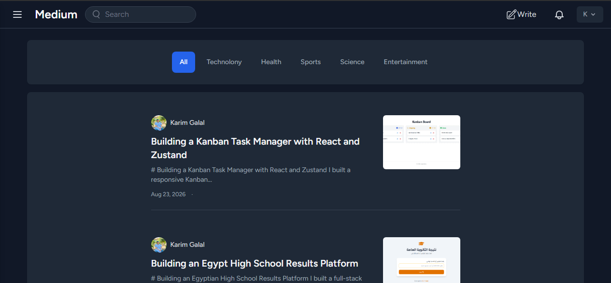
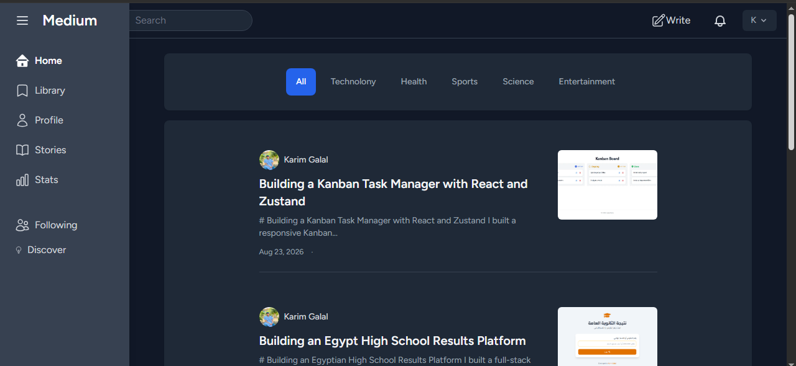
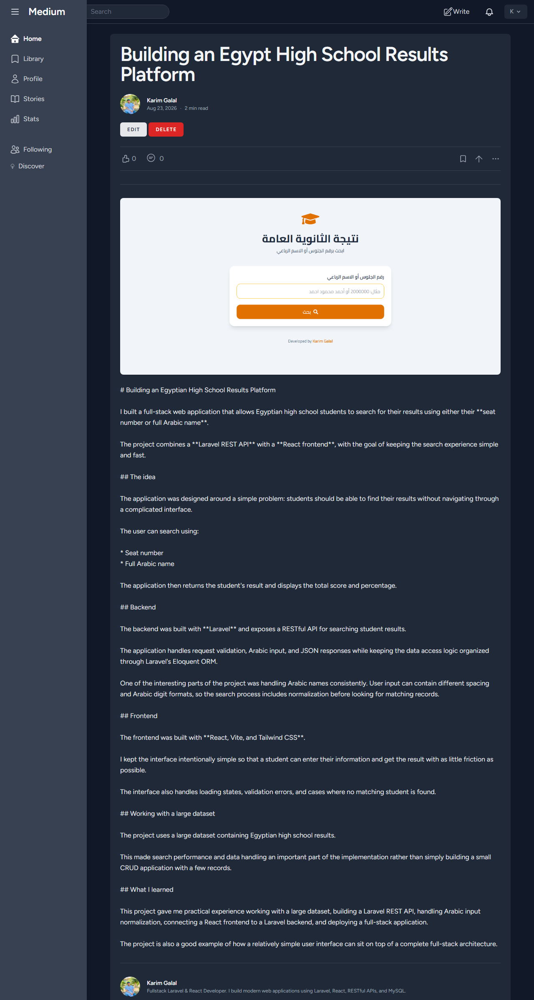
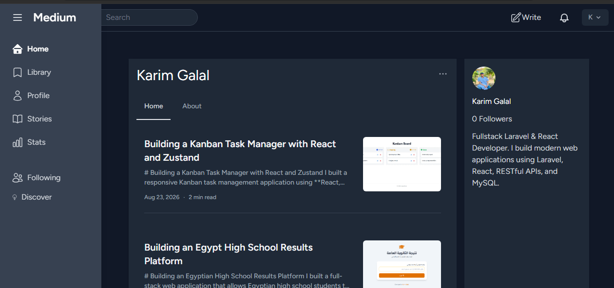
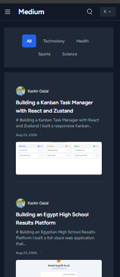

# Medium Clone


A full-stack blog platform inspired by Medium, built with Laravel and Blade.

The application allows users to create and publish articles, discover content by category, interact with other users, and manage their profiles.

---

## Features

### Authentication

* User registration and login
* Email verification
* Password reset
* Remember me functionality
* Session-based authentication

### Content Management

* Create and publish articles
* Edit existing articles
* Article categories
* Cover image uploads
* Automatic post slugs
* Estimated reading time
* Paginated article listings
* Category-based filtering

### Social Features

* Follow and unfollow users
* Like and unlike articles
* Public user profiles
* Follower and following relationships

### User Profiles

* Custom username
* Profile image
* User bio
* Public profile pages
* Profile settings

---

## Screenshots

### Home



### Home with Sidebar



### Read Article



### User Profile



### Mobile View



---


## Tech Stack

### Backend

* Laravel
* PHP
* MySQL
* Eloquent ORM
* Laravel Breeze

### Frontend

* Blade
* Tailwind CSS
* Alpine.js
* Axios
* Blade Heroicons

### Additional Tools

* Spatie Media Library
* Vite
* Pest

---

## Architecture

The application follows Laravel's traditional MVC architecture with server-side rendered Blade views.

```text
Request
   ↓
Route
   ↓
Controller
   ↓
Eloquent Model
   ↓
MySQL
   ↓
Blade View
```

Alpine.js and Axios are used where client-side interaction is needed, such as follow and like actions.

---

## Project Structure

```text
app/
├── Http/
│   ├── Controllers/
│   └── Requests/
├── Models/
└── View/

database/
├── factories/
├── migrations/
└── seeders/

resources/
├── css/
├── js/
└── views/

routes/
├── web.php
└── auth.php

storage/
```

---

## Database Relationships

The application uses Eloquent relationships to model the main entities:

```text
User
├── hasMany → Posts
├── hasMany → Likes
├── belongsToMany → Followers
└── belongsToMany → Following

Post
├── belongsTo → User
├── belongsTo → Category
└── hasMany → Likes

Category
└── hasMany → Posts
```

---

## Technical Highlights

* Laravel MVC architecture
* Eloquent model relationships
* Route model binding
* Username-based user URLs
* Slug-based article URLs
* Many-to-many follower relationships
* Article like system
* Image upload and media management
* Form validation
* Pagination
* Eager loading for related data
* AJAX interactions using Axios
* Responsive UI with Tailwind CSS

---

## Installation

Clone the repository:

```bash
git clone https://github.com/Karim-Galal/medium_clone.git
cd medium_clone
```

Install PHP dependencies:

```bash
composer install
```

Create the environment file:

```bash
cp .env.example .env
```

Generate the application key:

```bash
php artisan key:generate
```

Configure your database credentials in `.env`, then run:

```bash
php artisan migrate
```

Create the storage link:

```bash
php artisan storage:link
```

Install frontend dependencies:

```bash
npm install
```

Start the development environment:

```bash
npm run dev
```

In another terminal, run the Laravel development server:

```bash
php artisan serve
```

---


---

## Project Status

This project was built as a full-stack Laravel application inspired by Medium and focuses on content management, authentication, database relationships, and social interactions.

---

## Future Improvements

* Article comments
* Advanced article search
* Notifications
* Rich text editing
* Improved content discovery
* Automated test coverage

---

## Author

**Karim Galal**

Full-Stack Laravel & React Developer
